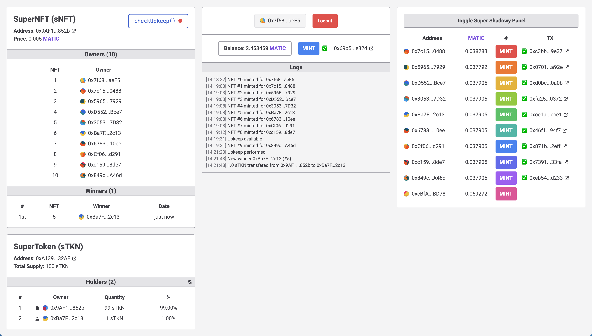

# Super NFT - Chainlink Keepers Demo

Demo of a NFT that automatically reward randomly selected owners each 10 NFTs minted.



## Getting Started

Clone the repository and install dependencies via `yarn install`.  
Copy `.env.example` to `.env` and configure variables.

### Build, deploy and verify contracts

```
npx hardhat run scripts/deploy.ts
npx hardhat verify --contract contracts/Token.sol:SuperToken ${ERC20Address}
npx hardhat verify --contract contracts/NFT_VRF.sol:SuperNFTVRF ${NFTAddress} ${ERC20Address}
```

### Configure and run UI

Go to `ui` directory and install dependencies via `yarn install`.  
Copy `.env.example` to `.env` and configure variables.  
Run the UI and go to http://localhost:8080/.
```
yarn serve
```

You will need to funds accounts in order to use them, you can get test tokens form faucet https://faucet.polygon.technology/.  
Run the following comman in root directory to ditribute tokens
```
npx hardhat scripts/funds.ts
```